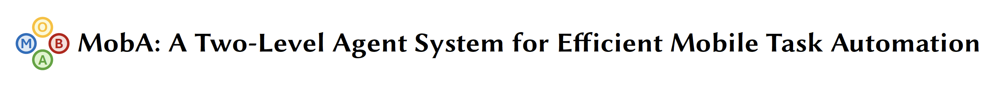

<div align="center">
</img> 

</img>

**🎮 MobA manipulates mobile phones just like how you would.**

🌐 [Website](https://github.com/OpenDFM/MobA) | 📃 [Paper](https://arxiv.org/abs/2410.13757/) | 🤗 [MobBench](https://huggingface.co/datasets/OpenDFM/MobA-MobBench) | 🗃️ [Code](https://github.com/OpenDFM/MobA)

[简体中文](./README_zh.md) | English

</div>


## 🔥 News

- **[2024.10.19]** We release MobBench on [Huggingface](https://huggingface.co/datasets/OpenDFM/MobA-MobBench) and provide the corresponding English translation.
- **[2024.10.18]** We open-source MobA on [GitHub](https://github.com/OpenDFM/MobA), and our paper is available on [arXiv](https://arxiv.org/abs/2410.13757).

## 📖 Introduction

Current mobile assistants are limited by dependence on system APIs or struggle with complex user instructions and diverse interfaces due to restricted comprehension and decision-making abilities. To address these challenges, we propose MobA, a novel Mobile phone Agent powered by multimodal large language models that enhances comprehension and planning capabilities through a sophisticated two-level agent architecture. The high-level Global Agent (GA) is responsible for understanding user commands, tracking history memories, and planning tasks. The low-level Local Agent (LA) predicts detailed actions in the form of function calls, guided by sub-tasks and memory from the GA. Integrating a Reflection Module allows for efficient task completion and enables the system to handle previously unseen complex tasks. MobA demonstrates significant improvements in task execution efficiency and completion rate in real-life evaluations, underscoring the potential of MLLM-empowered mobile assistants. 

## 🔧 Deployment

> MobA is still under development, and we are keeping updating the code. Please stay tuned!

### System Requirements

Make sure you have installed [Android Debug Bridge (ADB)](https://developer.android.google.cn/tools/adb), and you have connected your Android device to your computer. You should be able to see your devides with command `adb devices`.

### Environment Setup

```shell
conda create -n moba python=3.12
conda activate moba
pip install numpy opencv-python openai generativeai pillow colorama
```

You may also use `requirements.txt` to install the required packages (However it is not recommended since there are many unused packages).

### Run MobA

You need to specify the configuration file in `config.yaml` before running MobA. You can find the configuration file in the `moba` folder.

```bash
vim ./moba/config.yaml
cd ./moba/agent
python executor.py
```

You should be able to run MobA smoothly on Windows now. You can find MobBench, the fifty tasks we tested in the paper, on [huggingface](https://huggingface.co/datasets/OpenDFM/MobA-MobBench).

## 📑 Citation

If you find our work useful, please cite us!

```bib
@misc{zhu2024moba,
      title={MobA: A Two-Level Agent System for Efficient Mobile Task Automation}, 
      author={Zichen Zhu and Hao Tang and Yansi Li and Kunyao Lan and Yixuan Jiang and Hao Zhou and Yixiao Wang and Situo Zhang and Liangtai Sun and Lu Chen and Kai Yu},
      year={2024},
      eprint={2410.13757},
      archivePrefix={arXiv},
      primaryClass={cs.MA},
      url={https://arxiv.org/abs/2410.13757}, 
}
```

## 📧 Contact Us

If you have any questions, please feel free to contact me via email `JamesZhutheThird@sjtu.edu.cn`.
