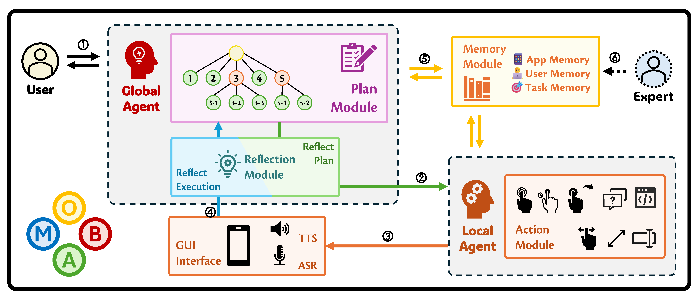

<div align="center">
</img> 

</img>

**🎮 MobA 操作手机就像你一样.**

🌐 [网站](https://github.com/OpenDFM/MobA) | 📃 [论文](https://arxiv.org/abs/2410.13757/) | 🤗 [MobBench](https://huggingface.co/datasets/OpenDFM/MobA-MobBench) | 🗃️ [代码](https://github.com/OpenDFM/MobA)

简体中文 | [English](./README.md)

</div>

## 🔥 新闻

- **[2024.10.19]** 我们在 [Huggingface](https://huggingface.co/datasets/OpenDFM/MobA-MobBench) 上发布了MobBench，并提供对应英文翻译。
- **[2024.10.18]** 我们在 [GitHub](https://github.com/OpenDFM/MobA) 上开源了MobA，你现在可以在 [arXiv](https://arxiv.org/abs/2410.13757) 上看到我们的论文.

## 📖 介绍

当前手机上的智能助手通常受限于对系统和第三方应用程序API的依赖。同时，基于模型的屏幕代理由于对多样化界面和复杂指令的理解和决策能力有限，难以处理这些挑战。为了解决这些挑战，我们提出了 MobA，这是一个基于视觉语言大模型两层代理的手机助手，增强了理解和规划能力。高级别的全局代理（Global Agent, GA）负责解释用户指令、管理历史记录并规划任务，而低级别的本地代理（Local Agent, LA）则根据全局代理提供的子任务和记忆，通过功能调用精确执行操作。集成反思模块可以实现高效的任务完成，此外，通过引入双重反思机制，即使是以前未遇到的任务，MobA依然能够高效处理任务。在实际评估中，MobA在任务执行效率和完成率上表现出显著提升，展示了MLLM赋能的移动助手的巨大潜力。

## 🔧 部署

> MobA 仍在开发中，我们将持续更新代码。请保持关注！

### 系统要求

请确保您已经安装了 [Android Debug Bridge (ADB)](https://developer.android.google.cn/tools/adb)，并且您已经将您的 Android 设备连接到了您的计算机上。您应该可以通过 `adb devices` 命令看到您的设备。

### 环境设置

```shell
conda create -n moba python=3.12
conda activate moba
pip install numpy opencv-python openai generativeai pillow colorama
```

你也可以使用 `requirements.txt` 来安装所需的包（srds不推荐，因为有很多未使用的包）。

### 运行 MobA

你需要在运行 MobA 之前在 `config.yaml` 中指定配置文件。您可以在 `moba` 文件夹中找到配置文件。

```bash
vim ./moba/config.yaml
cd ./moba/agent
python executor.py
```

你现在应该可以在 Windows 上顺利运行 MobA 了。你可以在 [huggingface](https://huggingface.co/datasets/OpenDFM/MobA-MobBench) 上找到 MobBench，即我们在论文中测试的那五十个任务。


## 📑 引用

如果您觉得我们的工作有用，请引用我们！

```bib
@misc{zhu2024moba,
      title={MobA: A Two-Level Agent System for Efficient Mobile Task Automation}, 
      author={Zichen Zhu and Hao Tang and Yansi Li and Kunyao Lan and Yixuan Jiang and Hao Zhou and Yixiao Wang and Situo Zhang and Liangtai Sun and Lu Chen and Kai Yu},
      year={2024},
      eprint={2410.13757},
      archivePrefix={arXiv},
      primaryClass={cs.MA},
      url={https://arxiv.org/abs/2410.13757}, 
}
```

## 📧 联系我们

如果您有任何问题，请随时通过电子邮件 `JamesZhutheThird@sjtu.edu.cn` 与我联系。
